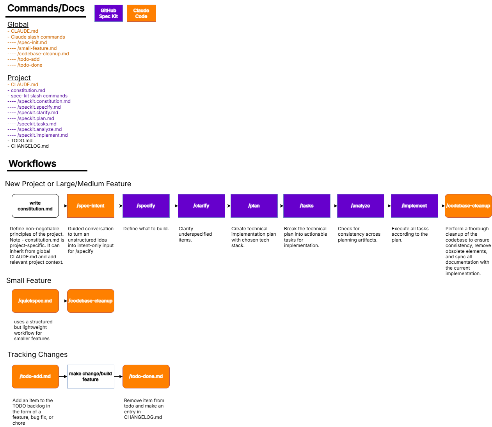

## Purpose
This repo codifies the approach and processes I use for SDD, and serves to version control my custom slash commands and global+project document templates. It is a living document. I prefer Claude Code and GitHub Spec Kit, but this approach could work with any agentic coding tool (ex. GitHub Copilot, Cursor) and alternative SDD package ( ex. BMAD-METHOD, OpenSpec).

**SDD (Specification-Driven Development)** means writing clear intent and requirements before implementation. The agent builds from specs, not ambiguous requests. **GitHub Spec Kit** is a package providing templated slash commands for creating specifications, plans, and tasks. This workflow prevents scope creep and reduces rework by forcing upfront clarity.

See the following overview. Items are explained in greater detail below.

---

## Key Documents

### Global
- **CLAUDE.md** — Personal coding standards, project structure conventions, and universal guidelines applied across all projects. Defines default behavior for any project without specific overrides.

### Project
- **CLAUDE.md** — Project-specific context, architecture decisions, and development notes. Provides domain knowledge and technical constraints to the agent.
- **constitution.md** — Non-negotiable principles and constraints that cannot be violated during implementation. Generated via spec kit to formalize project boundaries.
- **TODO.md** — Task backlog organized by type (features, bugs, chores). Single source of truth for planned work. This is also useful context for the agent.
- **CHANGELOG.md** — Chronological log of completed work. Updated when tasks are marked done, creating an audit trail.

---

## Custom Slash Commands

### Claude Code

**`/spec-intent`**
Turn unstructured ideas into clean, intent-only input for spec kit workflows. Extracts core problem, users, constraints, and success criteria through guided questions.

**`/quickspec`**
Lightweight spec-driven workflow for small features. Three-phase approach: spec → plan → build, with artifacts stored in `.quickspec/`.

**`/codebase-cleanup`**
Comprehensive codebase cleanup and consistency check. Removes obsolete code, syncs documentation, detects dead database columns, and fixes architectural drift.

**`/todo-add`**
Add tasks to the project backlog. Used for idea/task capture. Appends items to `TODO.md` categorized as features, bugs, or chores.

**`/todo-done`**
Complete tasks and log changes. Marks tasks complete in `TODO.md` and appends dated entries to `CHANGELOG.md`.

### GitHub Spec Kit

The following commands are provided by the GitHub Spec Kit package and templated per-project:

- **`/speckit.constitution`** — Create or update project constitution
- **`/speckit.specify`** — Define what to build with structured specification
- **`/speckit.clarify`** — Clarify underspecified requirements
- **`/speckit.plan`** — Create technical implementation plan
- **`/speckit.tasks`** — Break plan into actionable tasks
- **`/speckit.analyze`** — Check consistency across planning artifacts
- **`/speckit.implement`** — Execute tasks according to plan

---

## When to Use What

| Scenario | Command | Reason |
|----------|---------|--------|
| Vague idea needs refinement | `/spec-intent` | Converts unstructured thinking into structured input for spec workflows |
| Small, isolated feature | `/quickspec` | Lightweight three-phase workflow without heavy spec kit overhead |
| Complex feature or new capability | `/speckit.specify` → `/speckit.plan` → `/speckit.tasks` | Full specification ensures alignment before significant work begins |
| Add work to backlog | `/todo-add` | Centralizes planned work in TODO.md |
| Complete and document work | `/todo-done` | Removes from TODO.md, adds to CHANGELOG.md with timestamp |
| Tech debt or drift detected | `/codebase-cleanup` | Systematic cleanup of obsolete code and documentation sync |

---

## Example Workflow

**Building a threat scoring pipeline:**

1. **Clarify intent**: `/spec-intent` → extracts core problem (score network events), users (SOC analysts), success criteria (99% events scored in <1s)
2. **Specify**: `/speckit.specify` → creates detailed spec with data sources, scoring logic, output format
3. **Plan**: `/speckit.plan` → technical design for pipeline architecture, model selection, infrastructure
4. **Break down**: `/speckit.tasks` → discrete implementation tasks with clear completion criteria
5. **Implement**: `/speckit.implement` → agent executes tasks according to plan
